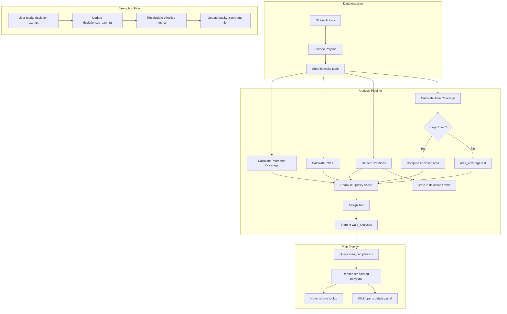
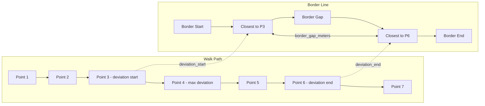

# Multi-Metric Area Completion Scoring System

This plan updates documentation to define a mathematically sound algorithm for tracking sub-area completion, including deviation detection for obstacle avoidance, a user-driven exemption system, and SQLite persistence.

## 1. Create ADR 003: Multi-Metric Completion Scoring

**Location:** [docs/ADR/003-multi-metric-completion-scoring.md](docs/ADR/003-multi-metric-completion-scoring.md)

### Core Concept: Separate Completion from Quality

The key insight is to decouple two concerns:

1. **Completion Status** - Binary: Has the area been walked at all?
2. **Quality Score** - Numeric: How well was it walked?

This allows areas to be marked "done" despite obstacles while still incentivizing better walks.

### Proposed Metrics

**Metric 1: Coverage (Recall)**

```
coverage = covered_perimeter_length / total_perimeter_length
```

- Uses existing 25m buffer approach
- Measures what percentage of the border was walked

**Metric 2: Alignment Error (RMSE)**

```
RMSE = sqrt(sum(distance_to_border^2) / n)
```

- For each GPS point in the walk, compute the perpendicular distance to the nearest border segment
- Root Mean Square Error penalizes large deviations more than small ones
- More mathematically sound than simple mean

**Metric 3: Maximum Deviation**

```
max_deviation = max(distance_to_border for each point)
```

- Identifies the worst-case deviation
- Useful for showing where obstacles forced the biggest detour

**Metric 4: 90th Percentile Deviation (P90)**

```
p90_deviation = percentile(distances, 90)
```

- More robust than max (ignores outliers like GPS glitches)
- Shows "typical worst" deviation

**Metric 5: Efficiency (Precision)**

```
efficiency = border_aligned_length / total_walk_length
```

- Penalizes unnecessary detours
- Rewards walkers who stay focused on the border

**Metric 6: Area Coverage (m²)**

```
area_coverage = enclosed_area_intersection / sub_area_total_area
```

- Measures what percentage of the sub-area's interior (m²) is enclosed by the walk path
- Requires the walk to form a closed polygon

**Calculation Method:**

1. Convert walk GPS points to a polygon by connecting the last point to the first
2. If start and end points are > 100m apart, the walk is considered "open" and area coverage = 0
3. Calculate the intersection of the walk polygon with the sub-area polygon using `turf.intersect()`
4. Compute ratio: `turf.area(intersection) / turf.area(subArea)`

**Edge Cases:**

- **Open path** (start/end > 100m apart): `area_coverage = 0` (walk didn't encircle the area)
- **Self-intersecting path**: Use `turf.unkinkPolygon()` to handle complex shapes
- **Walk extends outside sub-area**: Only the intersection portion counts
- **Multiple loops**: If the walk forms multiple distinct loops, use the union

**Why This Metric Matters:**

A walker could trace 80% of the perimeter but cut across the middle, enclosing only 40% of the area. Conversely, a walker who traces 70% of the perimeter but closes the loop properly might enclose 90% of the area. This metric rewards actually "conquering" the interior.

### Deviation Detection Algorithm

Detects "peninsula-shaped" detours where the walker left the border to avoid an obstacle and returned.

**Algorithm:**

```
deviation_threshold = 30m  // Distance from border to trigger deviation
deviations = []
in_deviation = false

for each point P in walk:
    distance = min_distance(P, border)
    
    if not in_deviation and distance > deviation_threshold:
        in_deviation = true
        deviation_start_index = previous_point_index
        deviation_start_border_point = nearest_border_point(previous_point)
    
    if in_deviation and distance <= deviation_threshold:
        in_deviation = false
        deviation_end_index = current_point_index
        deviation_end_border_point = nearest_border_point(P)
        
        record_deviation(
            start_index, end_index,
            start_border_point, end_border_point,
            max_deviation_in_segment,
            detour_distance,
            border_distance_bypassed
        )
```

**Deviation Metrics:**

- `border_gap`: Geodesic distance along the border between start and end points (how much border was "skipped")
- `detour_distance`: Actual path length during the deviation
- `max_deviation`: Furthest point from border during deviation
- `detour_ratio`: `detour_distance / border_gap`
- `return_accuracy`: Distance between deviation end point and the closest point on border to deviation start

**Heuristic Classification:**

```
if detour_ratio >= 2.0 and return_accuracy < 50m:
    classification = "obstacle_avoidance"  // Walker went around something
elif detour_ratio < 1.5:
    classification = "shortcut"  // Walker cut a corner
else:
    classification = "drift"  // General wandering
```

### Exemption System

Users can mark detected deviations as "exempt" - meaning the deviation was unavoidable due to real-world obstacles.

**Exemption Effect on Scoring:**

When a deviation is exempt:

1. The bypassed border segment is treated as "walked" (interpolated)
2. The detour path is excluded from RMSE calculation
3. Coverage increases by `border_gap` length
4. Efficiency calculation ignores the detour distance

**Required Exemption Data:**

- `exemption_reason`: User-provided text (e.g., "Private property", "Highway", "Construction")
- `exempted_at`: Timestamp
- `border_gap_meters`: How much border distance is being exempted

### Adjusted Quality Score (with exemptions)

```
effective_perimeter_coverage = (covered_length + sum(exempt_border_gaps)) / perimeter_length
effective_walk_length = total_walk_length - sum(exempt_detour_distances)
effective_rmse = rmse_excluding_exempt_segments
effective_efficiency = border_aligned_length / effective_walk_length

quality_score = (
  0.40 * effective_perimeter_coverage +
  0.25 * area_coverage +
  0.20 * (1 - min(effective_rmse / 50m, 1)) +
  0.15 * effective_efficiency
)
```

**Weight Rationale:**

- **Perimeter Coverage (40%)**: Still the primary goal - walk the border
- **Area Coverage (25%)**: Rewards closing the loop and actually encircling the area
- **Alignment (20%)**: Rewards staying close to the border
- **Efficiency (15%)**: Minor penalty for unnecessary detours

**Note:** If `area_coverage = 0` (open path), the score can still reach 0.75 max through other metrics, which is enough for Silver tier. This means open paths are valid but incentivizes closing the loop for Gold/Platinum.

### Tier System (for gamification)

| Tier     | Score Range | Color    | Meaning                          |

|----------|-------------|----------|----------------------------------|

| Platinum | >= 0.95     | Purple   | Near-perfect walk                |

| Gold     | >= 0.85     | Gold     | Excellent walk                   |

| Silver   | >= 0.70     | Silver   | Good walk                        |

| Bronze   | >= 0.50     | Bronze   | Completed (minimum threshold)    |

### Completion Threshold Changes

- **Old**: >75% coverage required to mark "Completed"
- **New**: >50% coverage marks area as "Completed" (Bronze tier)
- Rationale: Real-life obstacles (fences, highways, private property) may prevent high coverage; any serious attempt should count

## 2. Create ADR 004: SQLite Storage Architecture

**Location:** [docs/ADR/004-sqlite-storage.md](docs/ADR/004-sqlite-storage.md)

### Decision

Use SQLite as the local database for persisting all walk data, analysis results, and user exemptions.

### Database Schema

```sql
-- Strava users
CREATE TABLE users (
  id INTEGER PRIMARY KEY AUTOINCREMENT,
  strava_id INTEGER UNIQUE NOT NULL,
  username TEXT,
  access_token TEXT,
  refresh_token TEXT,
  token_expires_at INTEGER,
  created_at DATETIME DEFAULT CURRENT_TIMESTAMP
);

-- Sub-areas (cached from GeoJSON)
CREATE TABLE areas (
  id INTEGER PRIMARY KEY AUTOINCREMENT,
  fid INTEGER UNIQUE NOT NULL,           -- From GeoJSON properties.FID
  name TEXT NOT NULL,                     -- From properties.delomr
  perimeter_meters REAL NOT NULL,
  area_sqm REAL NOT NULL,                 -- Total area in square meters
  geometry_json TEXT NOT NULL,            -- Full polygon GeoJSON
  created_at DATETIME DEFAULT CURRENT_TIMESTAMP
);

-- Strava activities (walks)
CREATE TABLE walks (
  id INTEGER PRIMARY KEY AUTOINCREMENT,
  strava_activity_id INTEGER UNIQUE NOT NULL,
  user_id INTEGER NOT NULL REFERENCES users(id),
  name TEXT,
  total_distance_meters REAL,
  polyline TEXT NOT NULL,                 -- Encoded polyline
  started_at DATETIME,
  synced_at DATETIME DEFAULT CURRENT_TIMESTAMP
);

-- Analysis results (one per walk-area pair)
CREATE TABLE walk_analyses (
  id INTEGER PRIMARY KEY AUTOINCREMENT,
  walk_id INTEGER NOT NULL REFERENCES walks(id),
  area_id INTEGER NOT NULL REFERENCES areas(id),
  
  -- Perimeter metrics
  perimeter_coverage_percent REAL NOT NULL,
  covered_distance_meters REAL NOT NULL,
  rmse_meters REAL,
  max_deviation_meters REAL,
  p90_deviation_meters REAL,
  efficiency REAL,
  
  -- Area metrics (m²)
  area_coverage_percent REAL,             -- % of sub-area enclosed by walk
  enclosed_area_sqm REAL,                 -- Actual m² enclosed
  is_closed_loop BOOLEAN DEFAULT FALSE,   -- Did walk form a closed polygon?
  loop_gap_meters REAL,                   -- Distance between start and end
  
  -- Computed score
  quality_score REAL,
  tier TEXT CHECK(tier IN ('platinum','gold','silver','bronze')),
  
  -- Assignment
  is_primary_match BOOLEAN DEFAULT FALSE,
  
  analyzed_at DATETIME DEFAULT CURRENT_TIMESTAMP,
  UNIQUE(walk_id, area_id)
);

-- Detected deviations (obstacles avoided)
CREATE TABLE deviations (
  id INTEGER PRIMARY KEY AUTOINCREMENT,
  walk_analysis_id INTEGER NOT NULL REFERENCES walk_analyses(id),
  
  -- Position in walk
  start_point_index INTEGER NOT NULL,
  end_point_index INTEGER NOT NULL,
  
  -- Coordinates
  start_lat REAL NOT NULL,
  start_lng REAL NOT NULL,
  end_lat REAL NOT NULL,
  end_lng REAL NOT NULL,
  
  -- Measurements
  border_gap_meters REAL NOT NULL,        -- Border distance bypassed
  detour_distance_meters REAL NOT NULL,   -- Actual path taken
  max_deviation_meters REAL NOT NULL,     -- Furthest from border
  return_accuracy_meters REAL NOT NULL,   -- How close end is to start
  detour_ratio REAL NOT NULL,             -- detour / border_gap
  
  -- Classification
  classification TEXT CHECK(classification IN 
    ('obstacle_avoidance','shortcut','drift')),
  
  -- Exemption (user-set)
  is_exempt BOOLEAN DEFAULT FALSE,
  exemption_reason TEXT,
  exempted_at DATETIME,
  
  created_at DATETIME DEFAULT CURRENT_TIMESTAMP
);

-- User's best completion per area (denormalized for fast queries)
CREATE TABLE area_completions (
  id INTEGER PRIMARY KEY AUTOINCREMENT,
  user_id INTEGER NOT NULL REFERENCES users(id),
  area_id INTEGER NOT NULL REFERENCES areas(id),
  best_walk_analysis_id INTEGER REFERENCES walk_analyses(id),
  best_quality_score REAL,
  tier TEXT,
  total_walks INTEGER DEFAULT 1,
  first_completed_at DATETIME,
  best_completed_at DATETIME,
  UNIQUE(user_id, area_id)
);

-- Indexes for common queries
CREATE INDEX idx_walks_user ON walks(user_id);
CREATE INDEX idx_analyses_area ON walk_analyses(area_id);
CREATE INDEX idx_analyses_primary ON walk_analyses(is_primary_match) WHERE is_primary_match = TRUE;
CREATE INDEX idx_completions_user ON area_completions(user_id);
CREATE INDEX idx_deviations_exempt ON deviations(is_exempt) WHERE is_exempt = TRUE;
```

### Storage Location

- Development: `./data/citycells.db` (gitignored)
- Production: User's browser via `sql.js` (WebAssembly SQLite) with IndexedDB persistence

### Technology Choice: sql.js

Use `sql.js` - a WebAssembly port of SQLite that runs entirely in the browser:

- No server required for MVP
- Data persists in IndexedDB
- Full SQLite compatibility
- Can export/import database file for backup

## 3. Update PRD 001: New Features

**Location:** [docs/PRD/001-mvp-mobile-walker.md](docs/PRD/001-mvp-mobile-walker.md)

### New Section 3.4: Area Status Visualization

- All areas with a matched walk (>50% coverage) display as "completed" with tier-colored fill
- Unmatched areas remain gray outline only
- Tier colors: Platinum (purple `#a855f7`), Gold (`#eab308`), Silver (`#9ca3af`), Bronze (`#cd7f32`)

### New Section 3.5: Hover Interaction (Desktop/Long-press Mobile)

When hovering a completed area, display a tooltip showing:

- Area name
- Current tier badge (Platinum/Gold/Silver/Bronze)
- Quality score (e.g., "Score: 0.82")
- Number of matched walks
- Best walk summary (date, Strava link)

### New Section 3.6: Area Details Panel

Clicking/tapping an area opens a slide-up panel with:

1. **Header**

   - Area name
   - Tier badge and quality score

2. **Score Breakdown**

   - Perimeter Coverage: X% of border walked
   - Area Coverage: X% of interior enclosed (with visual indicator if loop is open)
   - Alignment: Xm average deviation (RMSE)
   - Max Deviation: Xm
   - Efficiency: X%
   - Number of exemptions applied

3. **Area & Perimeter Info**

   - Total area: X m² (or km² for large areas)
   - Enclosed area: X m² (your walk)
   - Total perimeter: X km
   - Your walked distance: X km
   - Loop status: Closed / Open (Xm gap)

4. **Walk History**

   - List of all matched walks for this area
   - Each showing: date, distance, individual score, Strava link
   - Highlight which walk is the current "best"

5. **Deviations Section** (if any detected)

   - List of detected deviations for best walk
   - Each showing: border gap, detour distance, classification
   - "Mark as Exempt" button with reason input
   - Visual indicator of exempted vs non-exempted

### New Section 3.7: Exemption Management

- When marking a deviation as exempt, user must provide a reason
- Predefined reasons: "Private property", "Highway/Road", "Water/River", "Construction", "Other"
- If "Other", free text input required
- Exemptions immediately recalculate the quality score
- Exemptions can be removed (un-exempted)

## 4. Update PROJECT_PLAN.md

### New Phase 3.5: Database Setup

- [ ] Install `sql.js` and configure WASM loading
- [ ] Create database initialization script
- [ ] Implement IndexedDB persistence layer
- [ ] Migrate GeoJSON areas to `areas` table on first load

### Updated Phase 4: Analysis Engine

- [ ] Implement perimeter coverage calculation (existing, refactor)
- [ ] Implement RMSE and deviation metrics
- [ ] Implement area coverage calculation (polygon intersection)
- [ ] Implement loop detection (start/end distance check)
- [ ] Implement deviation detection algorithm
- [ ] Implement exemption effect on score recalculation
- [ ] Create `calculateAnalysis(walk, area)` returning full metrics
- [ ] Store analysis results in `walk_analyses` table

### New Phase 4.5: Exemption System

- [ ] Create exemption API/service layer
- [ ] Implement score recalculation on exemption change
- [ ] Add deviation visualization on map (optional)

### Updated Phase 5: UI Components

- [ ] Add hover tooltip for completed areas
- [ ] Create Area Details Panel component
- [ ] Create Deviation List component with exemption controls
- [ ] Update area styling to use tier colors
- [ ] Add loading states for database operations

## Visual Flow Diagram



## Deviation Detection Visualization



## Files to Create/Update

- [docs/ADR/003-multi-metric-completion-scoring.md](docs/ADR/003-multi-metric-completion-scoring.md) - Create: Scoring algorithm with deviation detection
- [docs/ADR/004-sqlite-storage.md](docs/ADR/004-sqlite-storage.md) - Create: Database schema and storage architecture
- [docs/PRD/001-mvp-mobile-walker.md](docs/PRD/001-mvp-mobile-walker.md) - Update: Add sections 3.4-3.7 for new features
- [PROJECT_PLAN.md](PROJECT_PLAN.md) - Update: Add database and exemption phases