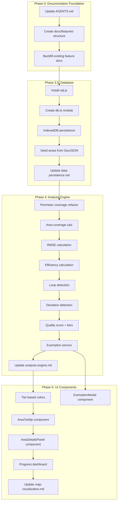

# Feature Gap Analysis: CityCells ADR/PRD vs Implementation

## Documentation-First Principle

Every implementation step MUST maintain three documentation layers:

1. **Code Documentation** - Inline comments explaining "why" for non-obvious decisions
2. **ADRs** (`docs/ADR/`) - High-level architectural decisions with rationale
3. **Feature Documentation** (`docs/features/`) - User-facing feature descriptions + implementation details

**Goal:** Any future agent can reconstruct the full mental model and rationale for all features.

---

## Phase 0: Documentation Foundation (DO FIRST)

Before implementing any features, establish the documentation infrastructure:

### 0.1 Update AGENTS.md

Add new section **1.4 Feature Documentation**:

- **Location**: `docs/features/`
- **When to update**: When implementing or modifying any user-facing feature
- **Structure**: One file per feature domain (e.g., `analysis-engine.md`, `map-visualization.md`)
- **Content requirements**:
                - Feature overview (what it does, why it exists)
                - Implementation details (key files, functions, data flow)
                - ADR references (link to relevant decisions)
                - Code rationale summary (non-obvious design choices)

Add new section **1.5 Code Rationale Comments**:

- Add `// WHY:` comments for non-obvious implementation choices
- Link to ADRs in comments where relevant (e.g., `// See ADR 003 for scoring formula`)
- Document magic numbers and thresholds with their source

Update **Workflow Checklist** to include:

- [ ] Update `docs/features/` with implementation details
- [ ] Add `// WHY:` comments for non-obvious code
- [ ] Verify feature docs allow mental model reconstruction

### 0.2 Create Feature Documentation Structure

```
docs/
├── ADR/                    # Architectural decisions (existing)
├── PRD/                    # Product requirements (existing)
└── features/               # NEW: Feature documentation
    ├── README.md           # Index of all features
    ├── authentication.md   # Strava OAuth flow
    ├── map-visualization.md # Map rendering, colors, interactions
    ├── analysis-engine.md  # All metric calculations
    ├── exemption-system.md # Deviation exemptions
    └── data-persistence.md # SQLite storage
```

### 0.3 Backfill Existing Features

Create initial feature docs for already-implemented features:

- `authentication.md` - Document existing Strava OAuth
- `map-visualization.md` - Document current map rendering (basic version)

---

## Current Implementation Status

### Implemented Features (Phase 1-3 Partial)

| Feature | Status | Location |

|---------|--------|----------|

| Next.js App Router setup | Done | `src/app/` |

| Leaflet/React-Leaflet map | Done | `src/components/Map/Map.tsx` |

| GeoJSON sub-areas rendering | Done | `src/components/Map/Map.tsx` |

| Strava OAuth (login/callback/logout) | Done | `src/app/api/auth/` |

| Activities API with `#malmödelområde` filter | Done | `src/app/api/activities/route.ts` |

| Basic perimeter coverage (25m buffer) | Done | `src/components/Map/Map.tsx` |

| Exclusive activity assignment (ADR 002) | Partial | `src/components/Map/Map.tsx` |

| Basic UI overlay with progress | Done | `src/app/page.tsx` |

### Missing Features (Grouped by Phase)

---

## Phase 3.5: Database Setup (ADR 004) - NOT STARTED

All SQLite/sql.js features from [ADR 004](docs/ADR/004-sqlite-storage.md) are missing:

**Code Changes:**

- Install `sql.js` dependency
- Configure WASM loading in Next.js (`next.config.ts`)
- Create `src/lib/db.ts` - database initialization module
- Implement IndexedDB persistence layer
- Create database schema (users, areas, walks, walk_analyses, deviations, area_completions)
- Seed `areas` table from GeoJSON
- Add export/import utilities

**Documentation Updates:**

- [ ] Create `docs/features/data-persistence.md` with:
                - Why SQLite over localStorage/IndexedDB directly (reference ADR 004)
                - Schema overview with table relationships
                - Persistence flow (sql.js -> IndexedDB)
                - Export/import feature explanation
- [ ] Update `PROJECT_PLAN.md` - check off Phase 3.5 items
- [ ] Add `// WHY:` comments in `db.ts` for initialization flow decisions

---

## Phase 4: Analysis Engine (ADR 003) - NOT STARTED

Reference: [ADR 003](docs/ADR/003-multi-metric-completion-scoring.md)

### 4.1 Core Metrics - Missing

Current code only calculates basic perimeter coverage. Missing:

1. **Area Coverage** - Polygon intersection using `turf.intersect()`:

                        - Detect if walk forms closed loop (start/end within 100m)
                        - Calculate enclosed area intersection

2. **RMSE Alignment Error** - For each GPS point, compute distance to nearest border:
   ```
   RMSE = sqrt(sum(distance_to_border^2) / n)
   alignment_score = 1 - min(RMSE / 50m, 1)
   ```

3. **Efficiency** - Border-aligned length / total walk length

4. **Loop Detection** - Check if start/end points are within 100m

**Documentation Updates for 4.1:**

- [ ] Create `docs/features/analysis-engine.md` with:
                - Overview of multi-metric scoring system (reference ADR 003)
                - Each metric explained: formula, rationale, weight
                - Magic numbers documented (25m buffer, 100m loop threshold, 50m RMSE normalization)
                - Data flow diagram: GPS points -> metrics -> score
- [ ] Add `// WHY:` comments for each threshold value referencing ADR 003
- [ ] Update `PROJECT_PLAN.md` - check off Phase 4.1 items

### 4.2 Deviation Detection - Missing

Algorithm from ADR 003 not implemented:

- Detect segments where walker deviated >30m from border
- Calculate deviation metrics (border_gap, detour_distance, max_deviation)
- Classify deviations (obstacle_avoidance, shortcut, drift)

**Documentation Updates for 4.2:**

- [ ] Update `docs/features/analysis-engine.md` with deviation detection section:
                - Algorithm pseudocode with explanation
                - Classification heuristic rationale (why 2.0 detour_ratio, 50m return_accuracy)
                - Example scenarios for each classification type
- [ ] Update `PROJECT_PLAN.md` - check off Phase 4.2 items

### 4.3 Scoring System - Missing

- **Quality Score Formula:**
  ```
  quality_score = 0.40 * perimeter_coverage 
 + 0.25 * area_coverage 
 + 0.20 * alignment_score 
 + 0.15 * efficiency
  ```

- **Tier Assignment** (from ADR 003):
                - Platinum: >= 0.95
                - Gold: >= 0.85
                - Silver: >= 0.70
                - Bronze: >= 0.50

- **Completion Threshold Change**: Current code uses >75%, but ADR 003 changed this to >50% (Bronze tier)

**Documentation Updates for 4.3:**

- [ ] Update `docs/features/analysis-engine.md` with scoring section:
                - Weight rationale (why 40/25/20/15 split)
                - Tier thresholds and their rationale
                - Edge cases (open paths max at 0.75)
- [ ] Update `PROJECT_PLAN.md` - check off Phase 4.3 items

### 4.4 Exemption System - Missing

- Service to add/remove exemptions on deviations
- Score recalculation when exemptions change

**Documentation Updates for 4.4:**

- [ ] Create `docs/features/exemption-system.md` with:
                - Why exemptions exist (real-world obstacles)
                - How exemptions affect each metric
                - Recalculation flow
                - Predefined exemption reasons and when to use each
- [ ] Update `PROJECT_PLAN.md` - check off Phase 4.4 items

---

## Phase 5: UI Components (PRD 001) - NOT STARTED

Reference: [PRD 001](docs/PRD/001-mvp-mobile-walker.md) sections 3.4-3.7

### 5.1 Tier-Based Visualization (PRD 3.4) - Missing

Current implementation uses green/amber/gray. PRD specifies:

| Tier | Fill Color | Hex | Opacity |

|------|------------|-----|---------|

| Platinum | Purple | `#a855f7` | 0.4 |

| Gold | Gold | `#eab308` | 0.4 |

| Silver | Gray | `#9ca3af` | 0.4 |

| Bronze | Bronze | `#cd7f32` | 0.4 |

**Documentation Updates for 5.1:**

- [ ] Create `docs/features/map-visualization.md` (or update if exists) with:
                - Color scheme rationale (why these specific colors)
                - Opacity choice (why 0.4)
                - Border styling decisions
                - Accessibility considerations
- [ ] Update `PROJECT_PLAN.md` - check off Phase 5.1 items

### 5.2 Hover Tooltip (PRD 3.5) - Missing

- Desktop: Mouse hover
- Mobile: Long-press (500ms)
- Display: Area name, tier badge, quality score, walk count, best walk link

**Documentation Updates for 5.2:**

- [ ] Update `docs/features/map-visualization.md` with tooltip section:
                - Why 500ms for long-press (UX research basis)
                - Information hierarchy in tooltip
                - Dismiss behavior rationale
- [ ] Update `PROJECT_PLAN.md` - check off Phase 5.2 items

### 5.3 Area Details Panel (PRD 3.6) - Missing

- Bottom sheet (slide-up) component
- Score breakdown table with weights
- Area/perimeter info
- Walk history list
- Deviations section

**Documentation Updates for 5.3:**

- [ ] Update `docs/features/map-visualization.md` with details panel section:
                - Why bottom sheet over modal (mobile-first rationale)
                - Information architecture decisions
                - Section ordering rationale
- [ ] Update `PROJECT_PLAN.md` - check off Phase 5.3 items

### 5.4 Exemption UI (PRD 3.7) - Missing

- Modal with reason selection
- "Mark as Exempt" / "Remove Exemption" buttons
- Real-time score recalculation

**Documentation Updates for 5.4:**

- [ ] Update `docs/features/exemption-system.md` with UI section:
                - Modal vs inline decision
                - Predefined reasons and why each exists
                - Confirmation flow rationale
- [ ] Update `PROJECT_PLAN.md` - check off Phase 5.4 items

### 5.5 Progress Dashboard - Missing

- Tier breakdown (Platinum/Gold/Silver/Bronze counts)
- Currently only shows simple progress bar

**Documentation Updates for 5.5:**

- [ ] Update `docs/features/map-visualization.md` with dashboard section:
                - Metrics shown and why
                - Gamification psychology (tier breakdown motivates improvement)
- [ ] Update `PROJECT_PLAN.md` - check off Phase 5.5 items

---

## Implementation Roadmap



## Recommended Priority Order

1. **Phase 0 (Documentation Foundation)** - Establish documentation infrastructure first
2. **Phase 3.5 (Database)** - Foundation for persistence
3. **Phase 4.1-4.3 (Core Metrics + Scoring)** - Complete analysis engine
4. **Phase 5.1 (Tier Colors)** - Visual feedback for scoring
5. **Phase 5.2-5.3 (Tooltip + Details Panel)** - User interaction
6. **Phase 4.2 (Deviation Detection)** - For exemption feature
7. **Phase 4.4 + 5.4 (Exemption System)** - Full exemption flow
8. **Phase 5.5 (Progress Dashboard)** - Polish

## Files to Create/Modify

**Documentation Files (New):**

- `docs/features/README.md` - Feature index
- `docs/features/authentication.md` - Strava OAuth (backfill)
- `docs/features/map-visualization.md` - Map rendering
- `docs/features/analysis-engine.md` - Metric calculations
- `docs/features/exemption-system.md` - Deviation exemptions
- `docs/features/data-persistence.md` - SQLite storage

**Documentation Files (Modify):**

- `AGENTS.md` - Add sections 1.4, 1.5, update workflow checklist
- `PROJECT_PLAN.md` - Check off items as completed

**Code Files (New):**

- `src/lib/db.ts` - Database initialization
- `src/lib/analysis.ts` - Multi-metric analysis functions
- `src/lib/exemptions.ts` - Exemption service
- `src/hooks/useDatabase.ts` - Database hook
- `src/components/AreaTooltip/AreaTooltip.tsx`
- `src/components/AreaDetailsPanel/AreaDetailsPanel.tsx`
- `src/components/ExemptionModal/ExemptionModal.tsx`
- `src/components/ProgressDashboard/ProgressDashboard.tsx`

**Code Files (Modify):**

- `src/components/Map/Map.tsx` - Integrate new analysis, tier colors
- `src/app/page.tsx` - Add new UI components
- `next.config.ts` - Configure sql.js WASM loading
- `package.json` - Add sql.js dependency

---

## Per-Step Documentation Checklist

For EVERY implementation step, complete this checklist before marking done:

- [ ] **PROJECT_PLAN.md** - Check off completed items
- [ ] **Feature Docs** - Update relevant `docs/features/*.md` file
- [ ] **Code Comments** - Add `// WHY:` comments for non-obvious decisions
- [ ] **ADR Check** - Does this change warrant a new/updated ADR?
- [ ] **PRD Check** - Does implementation match PRD? Update if diverged.

---

## Phase 8: Testing & Debugging Infrastructure (NEW)

### 8.1 Fix Area Coverage 0% Issue

**Investigation Points:**

1. Loop detection threshold (100m) - may be too strict for some GPS tracks
2. `calculateAreaCoverage()` requires `isClosedLoop` to be true
3. Need to verify actual GPS data to understand if walks ARE loops

**Root Cause Analysis:**

- Area coverage is ONLY calculated for closed loops (by design in ADR 003)
- If start/end points are >100m apart, isClosedLoop = false → Area = 0%
- This may be correct behavior OR the threshold needs adjustment

### 8.2 Test Infrastructure

**Test Fixtures (`__tests__/fixtures/`):**

```
__tests__/
├── fixtures/
│   ├── activities/           # Real Strava activity data
│   │   ├── walk-001.json     # Activity metadata + polyline
│   │   └── ...
│   └── areas/                # Sub-area GeoJSON extracts
│       └── test-area.json
├── analysis/
│   ├── perimeter-coverage.test.ts
│   ├── area-coverage.test.ts
│   ├── alignment.test.ts
│   ├── efficiency.test.ts
│   └── loop-detection.test.ts
└── utils/
    └── visualization.ts      # SVG/PNG generation helpers
```

**Fixture Format (activity):**

```json
{
  "id": 123456789,
  "name": "Walk name #malmödelområde",
  "polyline": "...",           // Encoded polyline
  "coordinates": [[lng,lat],...], // Decoded for convenience
  "distance": 1234.5,          // meters
  "start_date": "2024-01-01T10:00:00Z",
  "expected": {                // Ground truth for regression tests
    "matchedAreaId": 42,
    "perimeterCoverage": 0.85,
    "areaCoverage": 0.72,
    "isClosedLoop": true,
    "qualityScore": 0.78,
    "tier": "silver"
  }
}
```

### 8.3 Metric Visualization System

Create SVG visualizations for each metric showing:

1. **Perimeter Coverage:**

            - Sub-area polygon outline
            - Walk path overlaid
            - 25m buffer shaded
            - Covered segments highlighted green
            - Uncovered segments highlighted red

2. **Area Coverage:**

            - Sub-area polygon filled
            - Walk-enclosed polygon overlaid (different color)
            - Intersection area highlighted
            - Loop closure gap shown

3. **Alignment:**

            - Sub-area border
            - Walk path with color gradient (green=close, red=far)
            - Distance indicators at sample points

4. **Efficiency:**

            - Walk path with aligned portions (green)
            - Detour portions (orange/red)
            - Deviation markers

**Implementation Approach:**

- Generate static SVGs during test runs
- Output to `__tests__/output/` directory
- Include in test reports
- Later: Add to app as "Debug Analysis" feature

### 8.4 Enhanced Metric Display

**Task:** Report the total circumference of a selected sub-area, the length of the walk, the length of the sub-area circumference, and the difference between them in the UI.

**Implementation (Completed):**

Added to `AreaDetailsPanel` component:

- **Sub-area Circumference**: Total perimeter length of the selected sub-area (`totalPerimeterMeters`)
- **Total Walk Length**: Complete distance of the walk (`totalWalkLengthMeters`)
- **Perimeter Walked**: Length of walk path that falls within the perimeter buffer (`coveredDistanceMeters`)
- **Walk vs Circumference**: Difference between walk length and circumference, displayed with "(detours)" if positive or "(efficient)" if negative

**Files Modified:**

- `src/components/AreaDetailsPanel/AreaDetailsPanel.tsx` - Added new metric display fields
- `docs/features/analysis-engine.md` - Updated with new displayed metrics section
- `docs/features/map-visualization.md` - Updated AreaDetailsPanel documentation
- `docs/ADR/003-multi-metric-completion-scoring.md` - Added "UI Display of Metrics" section documenting circumference/walk length display
- `docs/PRD/001-mvp-mobile-walker.md` - Updated section 3.6 "Area & Perimeter Info" to explicitly list all displayed metrics
- `PROJECT_PLAN.md` - Marked Phase 8.4 as complete